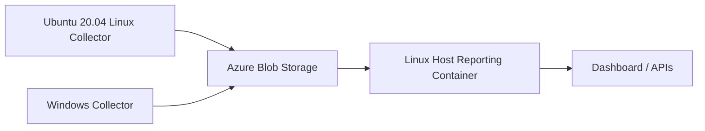

# Distributed Deployment Walkthrough

- **Status:** Active
- **Owner:** Repository Maintainers
- **Last Updated:** 2026-04-13
- **Scope:** Defines a supported deployment pattern for PSConnMon with a
  Linux collector on Ubuntu 20.04, a Windows collector, Azure Blob Storage as
  the telemetry backend, and the reporting service running as a container on a
  Linux host. Does not define CI/CD automation or long-term secret rotation.
- **Related:** [README](../../README.md), [Architecture](../spec/architecture.md), [Requirements](../spec/requirements.md), [Azure Deployment](../../infra/terraform/azure/README.md), [Troubleshooting Runbook](troubleshooting.md)

## Goal

Deploy PSConnMon in a topology where:

1. A Linux collector on Ubuntu 20.04 monitors path health, Linux Kerberos
   health, and SMB shares by using Linux auth profiles.
2. A Windows endpoint monitors the same estate and can provide parallel
   Windows-native UNC validation.
3. Both collectors upload JSONL batches into Azure Blob Storage.
4. The reporting service imports those Azure batches and serves the live
   dashboard from a Linux host container.

## Repository Review Findings

These findings come directly from the current implementation and affect the
deployment plan:

- The PowerShell collector supports Azure upload by either SAS token or managed
  identity, but the managed identity path calls the Azure Instance Metadata
  Service directly. Off-Azure collectors **MUST** use `sasToken` rather than
  `managedIdentity`.
- Linux share probing now supports `currentContext`, `kerberosKeytab`, and
  `usernamePassword` auth profiles. Linux `domainAuth` probes validate Kerberos
  only for `currentContext` or `kerberosKeytab` profiles; explicit
  `usernamePassword` profiles remain SMB-only.
- Share probes are attached to a target's `shares` collection. A domain
  controller and its authenticated share are modeled as one target with one or
  more share entries, not as separate top-level objects.
- The repository `docker-compose.yml` defaults the reporting service to local
  import mode. A live Azure-backed deployment **MUST** override the service
  environment to use `PSCONNMON_IMPORT_MODE=azure` or `hybrid`.

## Reference Topology



## Assumptions

- **Assumption:** The Linux collector runs Ubuntu 20.04 with PowerShell 7.x
  available.
- **Assumption:** The Linux reporting host is not an Azure-managed compute
  resource. This walkthrough therefore uses SAS for Azure access from the
  Linux-hosted container.
- **Assumption:** The Linux collector uses local JSON secret files and optional
  keytabs stored under the config directory or the collector spool `secrets/`
  directory.
- **Assumption:** The Windows collector runs under a security context that can
  reach the target shares if you want Windows-side UNC validation in parallel.

## Prerequisites

| Platform | Required Components |
| --- | --- |
| Azure operator workstation | Terraform, Azure CLI, rights to create or reuse a storage account and private blob container |
| Ubuntu 20.04 Linux collector | PowerShell 7.x, `ThreadJob`, and `ConvertFrom-Yaml` support when using `.yaml` or `.yml` configs, `traceroute`, `smbclient`, `dig` or `nslookup`, `klist`, and `kinit` when using `domainAuth` or keytab-backed SMB probes, outbound HTTPS to Azure Blob Storage |
| Windows collector | Windows PowerShell 5.1 or PowerShell 7.x, `ThreadJob`, and `ConvertFrom-Yaml` support when using `.yaml` or `.yml` configs, outbound HTTPS to Azure Blob Storage |
| Linux reporting host | Docker Engine or compatible runtime, persistent local storage for DuckDB, inbound HTTP/HTTPS access to the dashboard |

## Step 1: Provision the Azure Backend

This repository already includes Terraform for the Azure control plane under
[`infra/terraform/azure`](../../infra/terraform/azure). For this walkthrough,
use it to provision storage and skip Azure Container Apps because the reporting
service will run on your Linux host.

Create a deployment-specific tfvars file such as
`infra/terraform/azure/prod-linux-host.tfvars`:

```hcl
location                     = "centralus"
resource_group_name          = "rg-psconnmon-prod"
log_analytics_workspace_name = "log-psconnmon-prod"
user_assigned_identity_name  = "id-psconnmon-prod"

deploy_storage         = true
storage_account_name   = "psconnmonprod01"
storage_container_name = "telemetry"

deploy_container_app = false

tags = {
  application = "psconnmon"
  environment = "prod"
}
```

Apply the stack:

```bash
terraform -chdir=infra/terraform/azure init
terraform -chdir=infra/terraform/azure validate
terraform -chdir=infra/terraform/azure plan -var-file=prod-linux-host.tfvars
terraform -chdir=infra/terraform/azure apply -var-file=prod-linux-host.tfvars
```

Record the following values after apply:

- `storage_account_name`
- `storage_account_id`
- The blob container name, for example `telemetry`

If the collectors and Linux host are off Azure, create a container SAS that
grants read and write access to config and event blobs:

```bash
az storage container generate-sas \
  --account-name psconnmonprod01 \
  --name telemetry \
  --permissions racwl \
  --expiry 2026-12-31T00:00:00Z \
  --auth-mode login \
  --https-only \
  -o tsv
```

Store the resulting SAS outside the repository.

## Step 2: Model the Targets

PSConnMon models shares inside the owning target. The requested estate maps to
two targets:

1. A `dc01` target that represents the domain controller and includes the
   authenticated share hosted on that DC.
2. A `fileshare01` target that represents the non-domain-joined SMB server and
   includes its exposed share.

Use this canonical target block as the starting point for both collectors. The
Linux collector example below assigns a target-scoped Kerberos profile to the
DC and overrides the non-domain share with a per-share credential profile:

```yaml
targets:
  - id: dc01
    fqdn: dc01.corp.example.com
    address: 10.10.0.10
    linuxProfileId: dc-keytab
    roles:
      - domain-controller
    tags:
      - core
      - auth
    dnsServers:
      - 10.10.0.10
    shares:
      - id: sysvol
        path: '\\dc01.corp.example.com\SYSVOL'
    tests:
      - ping
      - dns
      - domainAuth
      - share
      - internetQuality
      - traceroute
    externalTraceTarget: 1.1.1.1
  - id: fileshare01
    fqdn: fileshare01.branch.local
    address: 10.20.30.40
    roles:
      - fileserver
    tags:
      - non-domain
    dnsServers:
      - 10.10.0.10
    shares:
      - id: public
        path: '\\fileshare01\Public'
        linuxProfileId: fileshare-creds
    tests:
      - ping
      - share
      - traceroute
    externalTraceTarget: 8.8.8.8
```

## Step 3: Build the Collector Configs

Start from the built-in sample generator or the repository samples. For the
distributed summit demo, prefer these environment-specific sample files:

- [`samples/config/summit/ubuntu-branch-01.psconnmon.yaml`](../../samples/config/summit/ubuntu-branch-01.psconnmon.yaml)
- [`samples/config/summit/win-branch-01.psconnmon.yaml`](../../samples/config/summit/win-branch-01.psconnmon.yaml)

The inline YAML examples below remain generic reference patterns. Use the
`summit` samples as the starting point for your actual host-specific values.

Generate a new scaffold if needed:

```powershell
Import-Module ./PSConnMon/PSConnMon.psd1 -Force
Export-PSConnMonSampleConfig -Path ./config/ubuntu-branch-01.psconnmon.yaml -Force
```

Generating a `.yaml` scaffold also requires `ConvertTo-Yaml` support on the
system creating the file. Use a `.json` output path if you want to avoid that
extra YAML dependency during config authoring.

If a deployment-specific config contains a live SAS token, that file **MUST**
stay out of version control.

Collector-side YAML requirements:

- Local `.yaml` or `.yml` configs require `ConvertFrom-Yaml` support on that
  endpoint. If the runtime does not already expose `ConvertFrom-Yaml`, install
  the `powershell-yaml` module on that collector.
- Remote config polling of a `.yaml` or `.yml` blob also requires
  `ConvertFrom-Yaml` support on that collector. Keep the local config filename
  and `publish.azure.configBlobPath` extension aligned.
- If you want the lowest-dependency deployment on an endpoint, use `.json` for
  both the local config file and the remote blob path on that collector.

### Linux Collector Config

The Linux collector can carry Linux-native SMB coverage when you define
`auth.linuxProfiles[]` and store secret material locally on the node. This
example uses `dc-keytab` for Kerberos and `domainAuth` against the DC, plus
`fileshare-creds` for explicit SMB credentials against the non-domain share.

Create these local secret files before the first run:

```json
{
  "principal": "svc-psconnmon@CORP.EXAMPLE.COM",
  "keytabPath": "./svc-psconnmon.keytab",
  "ccachePath": "/var/lib/psconnmon/spool/secrets/krb5cc-dc-keytab"
}
```

Save that as `/etc/psconnmon/secrets/dc-keytab.json`.

```json
{
  "username": "fileshare-monitor",
  "password": "<stored-outside-repo>",
  "domain": ""
}
```

Save that as `/etc/psconnmon/secrets/fileshare-creds.json`.

Store `/etc/psconnmon/secrets/svc-psconnmon.keytab` with owner-only
permissions. Secret JSON files and referenced keytabs **MUST** remain under the
config directory or `<spoolDirectory>/secrets`.

#### Credential Handling Model

Linux credential handling in PSConnMon is split by probe type:

- `targets[].linuxProfileId` controls `domainAuth` for that target and also acts
  as the default Linux auth profile for target-scoped SMB checks.
- `targets[].shares[].linuxProfileId` overrides the target default only for that
  share probe. It does not affect `domainAuth`.
- `kerberosKeytab` **SHOULD** be the default for unattended Ubuntu or `systemd`
  deployments that need `domainAuth` or Kerberos-backed SMB access.
- `currentContext` **MAY** be used only when the collector host already keeps a
  valid Kerberos ticket cache in the service account context. It **MUST NOT**
  define `secretReference`.
- `usernamePassword` **MUST** be treated as SMB-only. `domainAuth` skips that
  mode with `DomainAuthUnsupportedProfileMode`.

Credential material **MUST** stay local to the collector:

- `auth.linuxProfiles[].secretReference` **MUST** point to a local JSON file.
- Secret JSON files **MUST NOT** be embedded inline in YAML or JSON configs and
  **MUST NOT** be stored in Azure config blobs.
- Keytabs, password JSON files, and SAS tokens **MUST** stay out of version
  control.
- `ccachePath` **SHOULD** point to a path writable by the Linux service account,
  typically under `<spoolDirectory>/secrets`.

For the summit topology, keep the target-level domain controller profile on
`dc01` as `kerberosKeytab`, then override only the non-domain share with a
`usernamePassword` profile.

```yaml
schemaVersion: '1.0'
agent:
  agentId: ubuntu-branch-01
  siteId: branch-a
  spoolDirectory: /var/lib/psconnmon/spool
  batchSize: 250
  publishIntervalSeconds: 30
  configPollIntervalSeconds: 300
  cycleIntervalSeconds: 30
  maxRuntimeMinutes: 0
  cleanupAfterDays: 7
publish:
  mode: azure
  format: jsonl
  csvMirror: false
  azure:
    enabled: true
    accountName: psconnmonprod01
    containerName: telemetry
    blobPrefix: events
    configBlobPath: configs/ubuntu-branch-01.psconnmon.yaml
    authMode: sasToken
    sasToken: '<collector-sas-token>'
tests:
  enabled:
    - ping
    - dns
    - domainAuth
    - share
    - internetQuality
    - traceroute
  pingTimeoutMs: 3000
  pingPacketSize: 56
  shareAccessTimeoutSeconds: 15
  tracerouteTimeoutSeconds: 60
  tracerouteProbeTimeoutSeconds: 3
  internetQualitySampleCount: 5
auth:
  linuxProfiles:
    - id: dc-keytab
      mode: kerberosKeytab
      secretReference: ./secrets/dc-keytab.json
    - id: fileshare-creds
      mode: usernamePassword
      secretReference: ./secrets/fileshare-creds.json
targets:
  - id: dc01
    fqdn: dc01.corp.example.com
    address: 10.10.0.10
    linuxProfileId: dc-keytab
    roles: [domain-controller]
    tags: [core, auth]
    dnsServers: [10.10.0.10]
    shares:
      - id: sysvol
        path: '\\dc01.corp.example.com\SYSVOL'
    tests: [ping, dns, domainAuth, share, internetQuality, traceroute]
    externalTraceTarget: 1.1.1.1
  - id: fileshare01
    fqdn: fileshare01.branch.local
    address: 10.20.30.40
    roles: [fileserver]
    tags: [non-domain]
    dnsServers: [10.10.0.10]
    shares:
      - id: public
        path: '\\fileshare01\Public'
        linuxProfileId: fileshare-creds
    tests: [ping, share, traceroute]
    externalTraceTarget: 8.8.8.8
extensions: []
```

### Windows Collector Config

The Windows endpoint is still useful for parallel Windows-native UNC checks, but
it is no longer the only supported way to cover authenticated SMB targets.

The Windows share probe uses the current Windows security context for UNC
access. PSConnMon does not currently support a separate Windows per-share
username/password credential profile. If a non-domain or alternate-credential
share requires explicit SMB credentials, validate it from the Linux collector
with `auth.linuxProfiles[]`, or pre-provision Windows access for the scheduled
task identity outside PSConnMon.

Traceroute timing also uses two knobs. `tests.tracerouteTimeoutSeconds` is the
overall PSConnMon timeout for the full traceroute job, while
`tests.tracerouteProbeTimeoutSeconds` is the per-hop wait passed to the native
traceroute command. Keep the per-hop value much lower than the overall timeout,
especially on Windows.

If you stay on Windows PowerShell 5.1, prefer JSON for the config file. If you
run PowerShell 7 with YAML support, the YAML form below is also valid. When you
switch to JSON, keep the local filename and `publish.azure.configBlobPath`
extension aligned.

```yaml
schemaVersion: '1.0'
agent:
  agentId: win-branch-01
  siteId: branch-a
  spoolDirectory: C:\ProgramData\PSConnMon\spool
  batchSize: 250
  publishIntervalSeconds: 30
  configPollIntervalSeconds: 300
  cycleIntervalSeconds: 30
  maxRuntimeMinutes: 0
  cleanupAfterDays: 7
publish:
  mode: azure
  format: jsonl
  csvMirror: false
  azure:
    enabled: true
    accountName: psconnmonprod01
    containerName: telemetry
    blobPrefix: events
    configBlobPath: configs/win-branch-01.psconnmon.yaml
    authMode: sasToken
    sasToken: '<collector-sas-token>'
tests:
  enabled:
    - ping
    - dns
    - share
    - internetQuality
    - traceroute
  pingTimeoutMs: 3000
  pingPacketSize: 56
  shareAccessTimeoutSeconds: 15
  tracerouteTimeoutSeconds: 60
  tracerouteProbeTimeoutSeconds: 3
  internetQualitySampleCount: 5
auth:
  linuxSmbMode: currentContext
  secretReference: ''
targets:
  - id: dc01
    fqdn: dc01.corp.example.com
    address: 10.10.0.10
    roles: [domain-controller]
    tags: [core, auth]
    dnsServers: [10.10.0.10]
    shares:
      - id: sysvol
        path: '\\dc01.corp.example.com\SYSVOL'
    tests: [ping, dns, share, internetQuality, traceroute]
    externalTraceTarget: 1.1.1.1
  - id: fileshare01
    fqdn: fileshare01.branch.local
    address: 10.20.30.40
    roles: [fileserver]
    tags: [non-domain]
    dnsServers: [10.10.0.10]
    shares:
      - id: public
        path: '\\fileshare01\Public'
    tests: [ping, share, traceroute]
    externalTraceTarget: 8.8.8.8
extensions: []
```

## Step 4: Deploy the Linux Collector on Ubuntu 20.04

Install the native dependencies required by the enabled probes:

```bash
sudo apt-get update
sudo apt-get install -y traceroute smbclient dnsutils krb5-user
pwsh -NoLogo -NoProfile -Command "Install-Module ThreadJob -Scope AllUsers -Force"
pwsh -NoLogo -NoProfile -Command "if (-not (Get-Command ConvertFrom-Yaml -ErrorAction SilentlyContinue)) { Install-Module powershell-yaml -Scope AllUsers -Force }"
```

The `powershell-yaml` install is required only when this collector will read a
`.yaml` or `.yml` config. If you use JSON on the Linux host, you can skip that
module install and point `-ConfigPath` plus `publish.azure.configBlobPath` at
`.json` files instead.

Select the identities before configuring Kerberos:

- The Linux collector **SHOULD** run as a normal local user that owns the
  deployed repository path and the secret material it needs. For the summit
  walkthrough, using an existing local user such as `blake` is valid if that
  account also needs access to `/opt/PSConnMon`.
- The AD identity used for keytab-backed `domainAuth` **SHOULD** be a dedicated
  service account such as `svc-psconnmon@CORP.EXAMPLE.COM`.
- The local Linux user and the AD Kerberos principal do not need to match.
- Personal AD identities **SHOULD NOT** be turned into long-lived keytabs unless
  you explicitly accept the operational and security trade-offs.

Prepare Ubuntu for Kerberos-backed `domainAuth` before the first collector run:

1. Ensure the Linux host can resolve the domain controller and realm records.

   On Ubuntu 20.04, update DNS persistently through netplan rather than editing
   `/etc/resolv.conf` directly. Example:

   ```yaml
   network:
     version: 2
     ethernets:
       eth0:
         dhcp4: true
         nameservers:
           addresses:
             - 10.10.0.10
           search:
             - corp.example.com
   ```

   Apply and verify it:

   ```bash
   sudo netplan apply
   resolvectl status
   ```

   ```bash
   getent hosts dc01.corp.example.com
   dig +short _kerberos._tcp.corp.example.com SRV
   ```

2. Ensure clock sync is healthy. Kerberos is sensitive to clock skew.

   ```bash
   timedatectl status
   ```

3. Configure `/etc/krb5.conf` so the collector realm maps to the correct AD
   domain and KDC. A minimal example is:

   ```ini
   [libdefaults]
       default_realm = CORP.EXAMPLE.COM
       dns_lookup_kdc = true
       dns_lookup_realm = false
       rdns = false

   [realms]
       CORP.EXAMPLE.COM = {
           kdc = dc01.corp.example.com
       }

   [domain_realm]
       .corp.example.com = CORP.EXAMPLE.COM
       corp.example.com = CORP.EXAMPLE.COM
   ```

4. Create the AD service account and generate the keytab on a Windows host with
   AD administration tools. A minimal flow is:

   ```powershell
   New-ADUser `
     -Name "svc-psconnmon" `
     -SamAccountName "svc-psconnmon" `
     -UserPrincipalName "svc-psconnmon@CORP.EXAMPLE.COM" `
     -Enabled $true `
     -AccountPassword (Read-Host "Service account password" -AsSecureString)
   Set-ADUser svc-psconnmon -Replace @{'msDS-SupportedEncryptionTypes'=24}
   ```

   ```cmd
   ktpass /out "%USERPROFILE%\Desktop\svc-psconnmon.keytab" /princ svc-psconnmon@CORP.EXAMPLE.COM /mapuser CORP\svc-psconnmon /crypto AES256-SHA1 /ptype KRB5_NT_PRINCIPAL /pass *
   ```

   Notes:

   - The `principal` string in the keytab **MUST** exactly match the principal
     configured in the Linux secret JSON.
   - If the Linux host uses MIT Kerberos, keep the realm consistently uppercase
     in the generated keytab, secret JSON, and validation commands.
   - Regenerating the keytab invalidates older copies for practical purposes.

5. After copying the keytab and secret JSON files into place, ensure the local
   Linux runtime user can read or write them and can create the Kerberos cache
   path.

   If you want the collector user to maintain the checked-out repository under
   `/opt/PSConnMon`, make that user the owner of the repository and service
   directories. For example, if the runtime account is `blake`:

   ```bash
   sudo chown -R blake:blake /opt/PSConnMon
   sudo install -d -o blake -g blake -m 700 /etc/psconnmon/secrets
   sudo install -d -o blake -g blake -m 700 /var/lib/psconnmon/spool/secrets
   sudo chown blake:blake /etc/psconnmon/secrets/dc-keytab.json
   sudo chown blake:blake /etc/psconnmon/secrets/fileshare-creds.json
   sudo chown blake:blake /etc/psconnmon/secrets/svc-psconnmon.keytab
   sudo chmod 600 /etc/psconnmon/secrets/dc-keytab.json
   sudo chmod 600 /etc/psconnmon/secrets/fileshare-creds.json
   sudo chmod 600 /etc/psconnmon/secrets/svc-psconnmon.keytab
   ```

6. Decide which Linux auth mode each target needs:

   - Use `kerberosKeytab` for unattended `domainAuth` or Kerberos-backed SMB.
   - Use `currentContext` only if the collector service user already acquires
     and renews its own Kerberos tickets outside PSConnMon.
   - Use `usernamePassword` only for SMB shares that do not participate in the
     Kerberos realm.

Copy the repository content to the Ubuntu host, for example under
`/opt/psconnmon`, and place the config file at
`/etc/psconnmon/ubuntu-branch-01.psconnmon.yaml`. For the summit demo, align
that deployed file with
[`samples/config/summit/ubuntu-branch-01.psconnmon.yaml`](../../samples/config/summit/ubuntu-branch-01.psconnmon.yaml).

Run a one-cycle validation first in the same Linux user context that will own
the long-running service:

```bash
cd /opt/psconnmon
sudo -u blake pwsh -NoLogo -NoProfile -File ./Watch-Network.ps1 \
  -ConfigPath /etc/psconnmon/ubuntu-branch-01.psconnmon.yaml \
  -RunOnce
```

Expected validation results:

- The command exits with code `0`.
- A `.jsonl` batch appears under `/var/lib/psconnmon/spool/pending` and then
  moves to `/var/lib/psconnmon/spool/uploaded` after upload.
- `domainAuth` succeeds for `dc01` when `kinit` and `klist` can use the keytab.
- The explicit-credential share probe runs without placing passwords in command
  arguments or event details.

Manual Kerberos checks for the domain share:

```bash
sudo -u blake klist -kte /etc/psconnmon/secrets/svc-psconnmon.keytab
sudo -u blake env KRB5CCNAME=/var/lib/psconnmon/spool/secrets/krb5cc-dc-keytab \
  kinit -V -k -t /etc/psconnmon/secrets/svc-psconnmon.keytab \
  svc-psconnmon@CORP.EXAMPLE.COM
sudo -u blake env KRB5CCNAME=/var/lib/psconnmon/spool/secrets/krb5cc-dc-keytab klist
sudo -u blake env KRB5CCNAME=/var/lib/psconnmon/spool/secrets/krb5cc-dc-keytab \
  smbclient //dc01.corp.example.com/SYSVOL --use-kerberos=required -c 'ls'
```

Adjust the Linux username, cache path, share path, and realm for your
environment. The important rule is that all of those commands **MUST** succeed as
the same local user that will run the collector service.

If those commands fail, do not start debugging inside PSConnMon yet. Correct the
host Kerberos state first. Typical root causes are:

- `/etc/krb5.conf` does not map the domain to the intended realm or KDC.
- DNS from the Ubuntu host does not resolve the domain controller correctly.
- The Linux clock is out of sync with the domain.
- The keytab principal or encryption types do not match the account in AD.
- The keytab was generated with a realm or principal spelling that does not
  exactly match the Linux `kinit` command and secret JSON.
- The `ccachePath` parent directory is not writable by the collector service
  account.

Manual explicit-credential check for the non-domain share:

```bash
cat >/tmp/fileshare-auth <<'EOF'
username = fileshare-monitor
password = <stored-outside-repo>
EOF
chmod 600 /tmp/fileshare-auth
smbclient //fileshare01/Public -A /tmp/fileshare-auth -c 'ls'
rm -f /tmp/fileshare-auth
```

Install the collector as a long-running systemd service:

```ini
[Unit]
Description=PSConnMon collector
After=network-online.target
Wants=network-online.target

[Service]
Type=simple
User=blake
WorkingDirectory=/opt/psconnmon
ExecStart=/usr/bin/pwsh -NoLogo -NoProfile -File /opt/psconnmon/Watch-Network.ps1 -ConfigPath /etc/psconnmon/ubuntu-branch-01.psconnmon.yaml
Restart=always
RestartSec=10

[Install]
WantedBy=multi-user.target
```

Update `ExecStart` to point at the exact deployed config path. For the summit
sample layout, that path is `/etc/psconnmon/ubuntu-branch-01.psconnmon.yaml`.
The `User=` value **MUST** be the same Linux identity that owns the secret files
and writes the Kerberos cache path. If you keep the summit walkthrough aligned
to local user `blake`, the manual `kinit`, `klist`, `smbclient`, and
`Watch-Network.ps1 -RunOnce` validation commands **SHOULD** all be executed as
`blake` before enabling the service.

## Step 5: Deploy the Windows Collector

Install the PowerShell module dependencies:

```powershell
Install-Module ThreadJob -Scope CurrentUser -AllowClobber
if (-not (Get-Command ConvertFrom-Yaml -ErrorAction SilentlyContinue)) {
    Install-Module powershell-yaml -Scope CurrentUser -AllowClobber
}
```

If Task Scheduler will run the collector as a different identity, install the
module for that identity or use an all-users scope. The `powershell-yaml`
install is required only when this Windows collector will read a `.yaml` or
`.yml` config. Use JSON if you want to avoid the extra YAML dependency on
Windows PowerShell 5.1.

Copy the repository to a stable path such as `C:\PSConnMon` and place the config
under `C:\ProgramData\PSConnMon\win-branch-01.psconnmon.yaml`. For the summit
demo, align that deployed file with
[`samples/config/summit/win-branch-01.psconnmon.yaml`](../../samples/config/summit/win-branch-01.psconnmon.yaml).

Run a one-cycle validation:

```powershell
Set-Location C:\PSConnMon
.\Watch-Network.ps1 -ConfigPath C:\ProgramData\PSConnMon\win-branch-01.psconnmon.yaml -RunOnce
```

Validate the two SMB paths from the same Windows identity that will run the
collector:

```powershell
Get-ChildItem '\\dc01.corp.example.com\SYSVOL' -Force | Select-Object -First 1
Get-ChildItem '\\fileshare01\Public' -Force | Select-Object -First 1
```

Configure Task Scheduler with these minimum settings:

- Program: `pwsh.exe` or `powershell.exe`
- Arguments:
  `-NoLogo -NoProfile -ExecutionPolicy Bypass -File C:\PSConnMon\Watch-Network.ps1 -ConfigPath C:\ProgramData\PSConnMon\win-branch-01.psconnmon.yaml`
- Trigger: `At startup`
- Run as: a service account or local identity that already has access to both
  SMB paths
- Restart on failure: enabled

## Step 6: Upload the Remote Configs to Azure

If you want the collectors to poll the Azure-hosted config blobs referenced by
`publish.azure.configBlobPath`, upload each config after local validation:

```bash
az storage blob upload \
  --account-name psconnmonprod01 \
  --container-name telemetry \
  --name configs/ubuntu-branch-01.psconnmon.yaml \
  --file /path/to/ubuntu-branch-01.psconnmon.yaml \
  --auth-mode login \
  --overwrite true
```

```bash
az storage blob upload \
  --account-name psconnmonprod01 \
  --container-name telemetry \
  --name configs/win-branch-01.psconnmon.yaml \
  --file /path/to/win-branch-01.psconnmon.yaml \
  --auth-mode login \
  --overwrite true
```

The collectors will upload telemetry batches into the expected virtual layout:

- `events/branch-a/<batch>.jsonl`

## Step 7: Run the Reporting Service on the Linux Host

Build the image from this repository:

```bash
docker build -t psconnmon-service:local .
```

Run the container in Azure import mode. This example uses SAS because the host
is assumed to be off Azure:

```bash
export PSCONNMON_AZURE_SAS_TOKEN='<service-sas-token>'

docker run -d \
  --name psconnmon-reporting \
  --restart unless-stopped \
  -p 8080:8080 \
  -v /srv/psconnmon/data:/data \
  -e PSCONNMON_DB_PATH=/data/psconnmon.duckdb \
  -e PSCONNMON_IMPORT_MODE=azure \
  -e PSCONNMON_IMPORT_INTERVAL_SECONDS=30 \
  -e PSCONNMON_AZURE_STORAGE_ACCOUNT=psconnmonprod01 \
  -e PSCONNMON_AZURE_STORAGE_CONTAINER=telemetry \
  -e PSCONNMON_AZURE_BLOB_PREFIX=events \
  -e PSCONNMON_AZURE_AUTH_MODE=sasToken \
  -e PSCONNMON_AZURE_SAS_TOKEN="$PSCONNMON_AZURE_SAS_TOKEN" \
  psconnmon-service:local
```

If the Linux host is an Azure VM and managed identity is available from inside
the container network, you **MAY** switch the service to
`PSCONNMON_AZURE_AUTH_MODE=managedIdentity` and omit the SAS token. Validate
that path explicitly before relying on it in production.

## Step 8: Validate the Live Dashboard

Health check:

```bash
curl http://<linux-host>:8080/healthz
```

Expected response:

```json
{"status":"ok"}
```

Import status:

```bash
curl http://<linux-host>:8080/api/v1/import/status
```

Expected results:

- `mode` is `azure`
- At least one source entry reports `source_type` of `azure`
- `imported` increases after collector uploads land in Blob Storage

Open `http://<linux-host>:8080/` and confirm:

- Both agents are visible in the fleet view.
- The `dc01` and `fileshare01` targets appear in the target explorer.
- Target detail for `dc01` shows `domainAuth`, DNS, ping, share, and traceroute
  data.
- Target detail for `fileshare01` shows SMB share results from the Linux
  collector, the Windows collector, or both.

## Failure Example and Corrective Action

Failure example:

- A Linux collector config enables `domainAuth` on a target that uses a
  `usernamePassword` Linux profile.

Expected handling:

- The collector emits `SKIPPED` with
  `errorCode = DomainAuthUnsupportedProfileMode`.
- Keep `domainAuth` only on targets that use `currentContext` or
  `kerberosKeytab`.
- Leave the explicit-credential profile attached only to SMB share probes.

## Immediate Triage

- If uploads fail from either collector, confirm `publish.azure.authMode` is
  `sasToken` for off-Azure nodes and verify the SAS has not expired.
- If the Linux collector reports `SKIPPED` for share probes, confirm
  `smbclient` is
  installed and that the selected Linux profile has the required local secret
  file or keytab.
- If the Linux collector reports `SKIPPED` for `domainAuth`, confirm the target
  uses a Kerberos-capable Linux profile and that `kinit` and `klist` are
  installed.
- If the dashboard stays empty, confirm the container is running with
  `PSCONNMON_IMPORT_MODE=azure` and the blob prefix matches `events`.
- If only one collector appears, inspect that node's local spool directory
  before changing cleanup settings.
