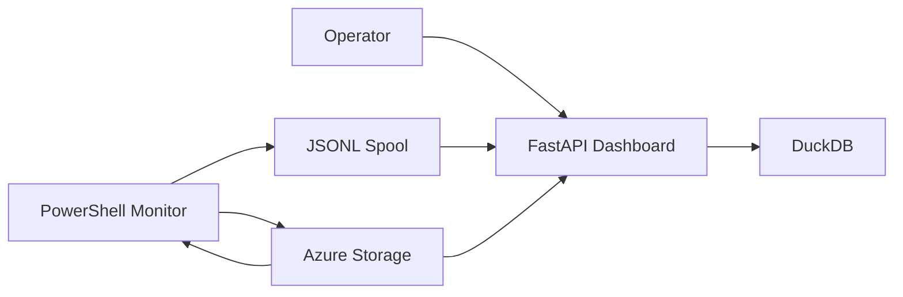

# PSConnMon Architecture

- **Status:** Active
- **Owner:** Repository Maintainers
- **Last Updated:** 2026-04-13
- **Scope:** Defines the target architecture for the monitoring service,
  reporting service, event flow, and Azure integration. Does not define release
  process policy.
- **Related:** [Requirements](requirements.md), [ADR-0001](../adr/ADR-0001-agent-service-architecture.md), [Roadmap](../../PSConnMon_Roadmap.md)

## Context

PSConnMon needs lightweight deployment, predictable failure behavior,
path-aware visualization, and a credible public cloud story. The old monolithic
script provided useful probes but not a durable product boundary.

## System Overview

- **PowerShell monitor:** Reads YAML or JSON config, runs probe cycles, writes
  JSONL batch files, optionally mirrors CSV, can resolve trusted local Linux
  SMB secret files, and can poll Azure Storage for updated config.
- **Structured target model:** Separates internal monitored hosts from
  agent-scoped `internetTargets`, so internet-quality and traceroute telemetry
  can be queried independently from host reachability.
- **Python reporting service:** Imports batches from local storage and Azure
  Blob Storage, stores hot data in DuckDB, and renders the built-in dashboard
  and APIs with separate internal/internet target views and per-target
  drilldowns.
- **Azure Storage:** Hosts versioned config blobs and raw telemetry uploads for
  centralized aggregation.

## Deployment Diagram

## Data Flow

1. The operator defines config in the canonical YAML or JSON schema, including
   internal `targets` and optional `internetTargets`.
2. The PowerShell monitor validates the config and executes a monitoring cycle.
3. Probes emit canonical events into a pending JSONL batch.
4. The reporting service imports `.jsonl` batches from a local directory,
   Azure Blob Storage, or both.
5. DuckDB serves the dashboard and summary APIs.
6. `POST /api/v1/ingest/batches` remains available for manual seeding and test
   workflows.
7. When enabled, Azure Storage holds raw batch uploads and remotely managed
   config blobs.

## Roadmap Mapping

| Architecture Element | Roadmap Mapping |
| --- | --- |
| Module-based agent | `Parameter Consolidation`, `PowerShell module` |
| Structured config schema | `JSON-Based Input`, `Command and Control Model` |
| JSON event batches | `Logging and Telemetry`, `Visualization & Reporting` |
| Cross-platform probe adapters | `Multi-Platform Support`, `Authentication Testing`, `Network Quality Features` |
| Internet target split | `Default Target Behavior`, `Visualization & Reporting` |
| Built-in dashboard | `Visualization & Reporting` |
| Azure Storage control plane | `Command and Control Model`, `Open Architecture Questions` |

## Failure Modes

- A failed share probe **MUST NOT** stop ping, DNS, traceroute, or internet
  quality probes.
- Missing Linux dependencies **MUST** emit `SKIPPED` events rather than crash
  the cycle.
- Linux secret and keytab paths **MUST** stay under the config directory or the
  monitor spool secrets directory.
- Azure config poll failures **MUST** keep the last-known-good config active.
- Azure upload failures **MUST** retain pending batches locally for retry.
- Import failures **MUST** be recorded in DuckDB without partially committing an
  invalid batch.
- Dashboard rendering **MUST** read from DuckDB only; it does not read the
  monitor spool or blob storage directly.

## Open Questions

- Linux Kerberos behavior may still require environment-specific validation for
  domain join, keytab lifecycle, and distro-specific `smbclient` behavior.
- The current Azure upload path supports managed identity and SAS; service
  principals and connection strings are intentionally deferred until there is a
  concrete operational requirement.
